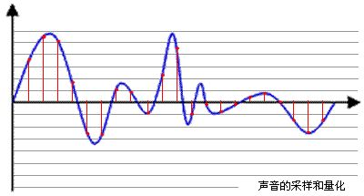

# 1.1 音视频基本概念
> 首先，我们需要先主了解下一些音视频常见的技术概念以及简单的原理。   

## 1.1.1 采样率

采样，是指把物理信号转化为数字信号的过程。采样频率，定义了每秒从连续信号中提取并组成离散信号的采样个数，单位为赫兹(Hz)。形象来说，采样频率是指将模拟信号转换成数字信号时的采样频率，也就是单位时间内采样多少点。 拿声音来说，采样频率可以是描述声音文件的音质、音调，衡量声卡、声音文件的质量标准。采样频率越高，即采样的间隔时间越短，则在单位时间内计算机得到的样本数据就越多，对信号波形的表示也越精确。  

## 1.1.2 比特率
比特率是指将模拟信号转化为数字信号后，单位时间内的二进制数据量，是衡量音视频质量的指标之一。单位为比特每秒(bps或者bit/s)。单位时间内比特率越大，精度就越高，处理出来的文件就越接近原始文件，音视频文件的质量也越高。
1000 bit/s = 1 kbit/s （一千位每秒）   
1000 kbit/s = 1 Mbit/s （一兆或一百万位每秒）  
1000 Mbit/s = 1 Gbit/s (一吉比特或十亿位每秒）   
拿声音来说，能够分辨语音的最低码率为800bps，通话质量一般来说是8kbps, FM广播一般是96kbps, MP3文件范围在8-320kbps之间(一般为128kpbs)， 16位CD一般为 1411kbps。    
音频比特率计算公式：【比特率】（kbps)=【量化采样点】（kHz）×【位深】（bit/采样点）×【声道数量】（一般为2）

在视频中，比特率又常被称为码率。16kbps为可视电话质量，128-384kpbs为商用视频会议质量，VCD一般为1.25Mbps，DVD为5Mkpbs，蓝光光碟为40Mbps。 
计算公式为：【码率】(kbps)=【文件大小】(KB) * 8 / 【时间】(秒)。比如一部1G的电影，时长60分钟，那么它的码率则为 1 x 1024 x 1024 x 8 / 3600 = 2300Kbps/s。  
  
## 1.1.3 帧率    
帧，可以理解为一张采集到的静止的画面。帧率则指的是每秒显示的帧数(Frames per Sercond, 简称FPS)。由于人眼的生理构造，当画面的帧率高于16帧每秒(16fps)时，就会产生一个视觉停留，看起来就是一个连贯的画面。比如我们看的动画片，也是同样的原理，动画师将一个个场景画出来，然后以一定的频率切换，就产生了一个连贯的动画场景。一般来说，电影的帧率为23.97fps,电视为25fps。   
  
## 1.1.4 分辨率
分辨率主要有2个分类：显示分辨率跟像素分辨率。显示分辨率指显示器能显示多少像素。像素分辨率指图像单位英寸中包含的像素点数量。
描述分辨率的单位有：（dpi点每英寸）、lpi（线每英寸）和ppi（像素每英寸）。lpi是描述光学分辨率的尺度的，与dpi/ppi含义不同。dpi一般用于印刷行业较多，而ppi常见于计算机领域。    
常见的分辨率尺寸：  
DV: 480 x 720    
720P: 720 x 1280    
1080P: 1080 x 1920    
2K: 1152 x 2048    
4k: 2160 x 4096   

