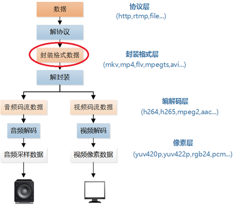

# 1.2 音视频播放流程
>  整个音视频播放的流程，可以拆解为下面几个主要流程：音视频采集->前处理->音视频编码->音视频处理/分发->音视频解码->后处理->渲染、播放。那么，音视频流在整个上下行链路中，具体有哪些流程，每一步具体做了什么？我们常见的直播美颜，滤镜，是在哪一步流程中处理的？下面会一一详细展开讲解。   

## 1.2.1 上行和下行
直播场景针对音视频流的来源，我们一般会分为上行以及下行，上行指的是音视频采集端将画面通过采集设备（摄像头，麦克风）采集后，通过编码后上行到 server，一般我们称主播端为上行端。下行指上行的视频流经过在server处理或者转发后，传输到 CDN 或者观众端。

## 1.2.2 音视频采集  
这一过程主要是利用摄像头/麦克风去分别捕获图像/声音信号，并将声音、图像从物理信号转化为数字信号。拿视频来说，如果设置了摄像头分辨率为640×480，帧率为30帧/s，那么每个画面大小约为50kb左右，那么摄像头每秒采集到的数据转化为数字信号后的比特率则为：50×30/s＝1500kbps＝1.5Mbps。

## 1.2.3 前处理    
 前处理介于采集以及编码中间，按照类型划分可以分为音频前处理和视频前处理，音频前处理包括降噪、回音消除、人声检测、自动增益等，视频前处理包括美颜、磨皮、设置对比度、镜像、水印等。一般来说，前处理都是在上行方客户端完成的，因为其需要消耗较大的cpu资源，放在server端成本较大，性能不佳。   

## 1.2.4 音视频编码     
 前面提到的音视频采集后的音视频流为裸码流，即没有经过编码压缩处理的数据。这里再举个例子，例如一个例子，一个720p(1280x720)，每秒30帧，60分钟的电影，其占用磁盘大小为：12Bx1280x720x30x60x100 = 1.9T。如果不经过压缩，传输这个视频的时间无疑将非常漫长，以电信100M宽带，大概需要下载43小时。所以需要对原始视频裸码流进行压缩，采用的手段就是音视频的编码，而编码的目的就是压缩。   
 视频编码通常都是有损压缩，目标是降低一点清晰度的同时让体积得到大大的减少，降低的清晰度能达到对人眼不可察觉或者几乎无法分辨的水平。主要是方法是去除视频里面的冗余信息，对于很多不是剧烈变化的场面，相邻帧里面有很多重复信息，通过帧间预测等方法分析和去除，而帧内预测可去掉同个帧里的重复信息，还有对画面观众比较关注的前景部分高码率编码，而对背景部分做低码率编码，等等，这些取决于不同的压缩算法。而解码相对的就是解压缩，还原成原始像素。常见的音视频编解码算法前面-章节已经提到，这里就不展开细讲了。    

## 1.2.5 音视频处理/分发   
 编码后的音视频数据通过某种传输协议(rtp,rtmp,rtsp等)上行到音视频处理/分发的服务器，服务器可以根据具体的业务场景去实现多路音视频的混流，转码，转协议，转发给具体的下行段。
 
## 1.2.6 音视频解码  
 当观众接收到音视频流时，浏览器是怎么把数据渲染成画面跟播放出声音的呢？ 
     
 上面是chrome内核Chromium对接收到的音视频数据进行处理的流程。当我们用HTML5播放视频，通过初始化一个video标签创建一个DOM对下，它会实例化一个WebMediaPlayer,这个Player通过去请求多媒体数据，进行解协议，就是图中Internet到DataSource这个过程，得到音视频的封装格式，比如MP4,FLV等。接着再解封装，这个过程一般称为demux，拿到音视频轨。拿视频轨道来说，里面分别会有I帧,B帧(可能没有),P帧。其中I帧是关键帧（I帧，Intra frame），包含了该帧的完整图象信息。另一些帧只是记录和参考帧的差异，叫帧间预测帧（Inter frame），所以比较小，预测帧有前向预测帧P帧和双向预测帧B帧，P帧是参考前面解码过的图像，而B帧参考双向的。用对应的音视频解码器去解码，得到原始数据。这里解demux使用的是chrome里面内置的开源第三方FFmpeg解码模块。 

## 1.2.7 渲染、播放     
把解码后的数据传给相应的渲染器对象进行渲染绘制，最后让video标签去显示或者声卡进行播放。    

 

