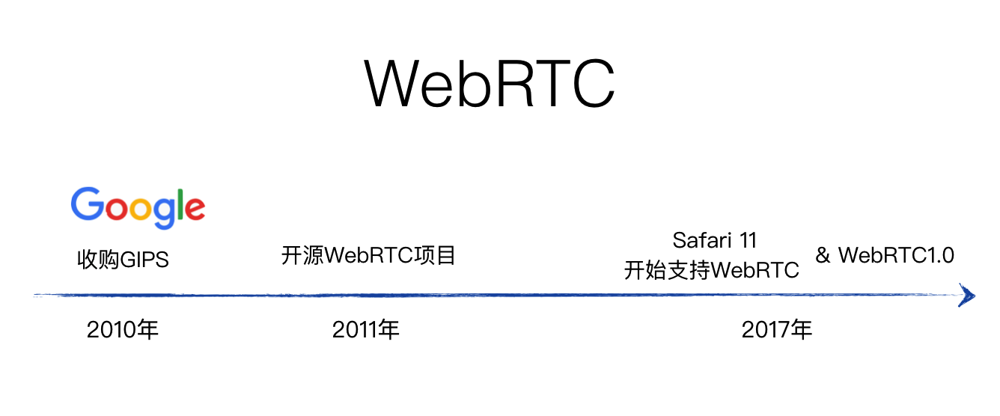
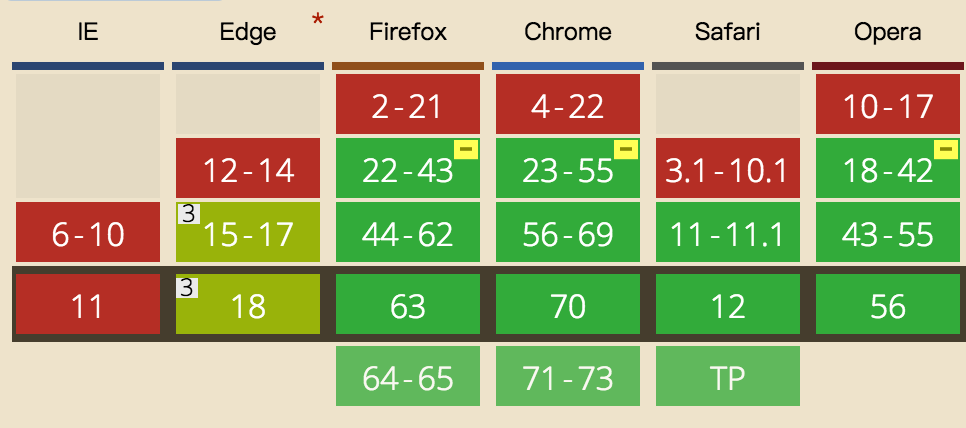
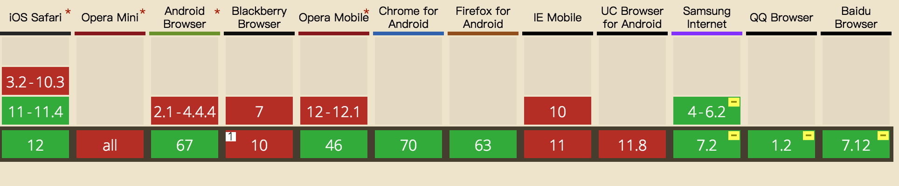

# 2.1 什么是WebRTC
WebRTC是一个google免费开源的项目，旨在为浏览器和移动应用程序提供低延迟，高质量的实时通信（RTC）功能。
待补充

## 2.1.1 WebRTC发展历史

WebRTC的前生是GIPS公司的实时通讯技术，Google于2010年以6820万美元收购GIPS公司。2011谷歌将从GIPS的实时通讯技术重新命名为WebRTC并开源。旨在让所有浏览器以及移动应用都能使用到这项免费，低延迟，高质量的实时通讯技术。从国内的发展历史来说，WebRTC从其开源后的几年时间，发展一直不温不火。但在2017年，随着直播场景的火爆，以及苹果宣布支持WebRTC，这项技术迎来了一次爆发期。    
WebRTC从2011年开源后，W3C也启动WebRTC计划，让WebRTC成为HTML5标准的一部分。经过几年的发展，W3C也不断在修改，制定WebRTC的特性标准规范，终于在2017年10月2号，宣布WebRTC1.0版本正式定稿。

## 2.1.2 WebRTC的兼容性  
**PC浏览器兼容性 :**  

    
WebRTC在PC浏览器上的兼容性，属于比较良好的。目前基本主流的浏览器(除了IE)之外，大部分都已经从之前的版本支持了。至于IE为什么不支持呢，微软于2014年开发了自己一套WebRTC的API(ORTC)。    

**移动浏览器兼容性 :**  
    
通过比较，我们可以看出WebRTC在移动端的兼容性，除了android外，其他浏览器只有在教新版本才支持。这可能对于一些移动web应用开发者来说有一些沮丧，但是，以下2点希望能让这部分开发者重振信心：   
* 微信/手Q基于X5内核的内嵌webview，已经支持了WebRTC能力
* 从最新版本的浏览器都开始支持WebRTC，说明它未来的发展前景肯定是一片光明

## 2.1.3 WebRTC应用场景

 我们可以通过WebRTC调用设备的摄像头，麦克风设备，通过WebRTC建立的低延迟通道，将媒体数据实时传输给对方。因此WebRTC可以运用于1对1，1对多的音视频通话场景，如视频会议，线上教学等。也可以通过WebRTC进行二进制数据的实时传输，因此也可以应用到即使通讯，游戏对战，文件共享等场景。

## 2.1.4 WebRTC发展前景
待补充