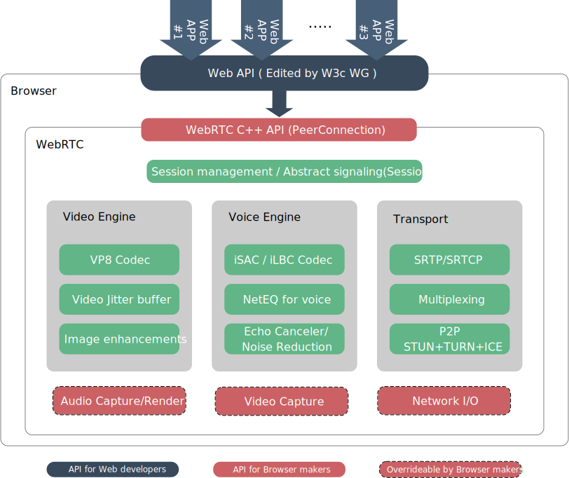

# 2.2 WebRTC 架构分析

> WebRTC 为 Web 开发者提供开发丰富的实时多媒体 Web 应用程序，不需要浏览器安装任何插件或其他软件。目的是为了创建健壮的实时通信平台,在不同平台、不同浏览器上运行。本节将介绍 WebRTC 的整体架构，其架构是非常复杂的，整体架构如下图：

WebRTC 大量复杂性被封装起来，隐藏了细节，让 Web 开发者通过少量的 API 就能够利用 WebRTC 能力。从上图我们能清晰的看到，整体架构分为三层：

1. Web 开发者，通过 JavaScript 程序调用浏览器提供的 API，实现实时多媒体通信应用程序
2. 浏览器开发者，实现 WebRTC C++ API、媒体捕获钩子以及渲染钩子，从而实现 WebRTC 能力。
3. WebRTC 开发者，实现了 WebRTC 绝大多数能力，音视频处理，数据传输的完整解决方案。

下面分别介绍每一个模块具体的负责的内容

## Web 应用程序

Web 开发者通过 JavaScript 程序调用浏览器提供的强大的 API 实现视频和音频实时通信应用程序，这些 API 高度封装，通过少量的必要数据，就能够建立安全可靠的实时通信连接进行媒体传输。

## Web API

是由 W3C 组织编写的标准，并由浏览器厂商实现，提供给 Web 开发者建立一个基础的视频聊天应用程序 API，这里通常指的是浏览器全局对象中 WebRTC 相关的对象，例如 PeerConnection 类，用于创建 WebRTC 连接。

## WebRTC Native C++ API

是一个 WebRTC 提供给浏览器的适配层，让浏览器开发者能够快速的实现 WebRTC 的 API，从而集成 WebRTC 能力到浏览器中。

其中上图中的最底部，三个模块（音频捕获，视频捕获，网络 IO）浏览器是可以选择性的覆盖 WebRTC 的实现。

## 传输会话组件

传输会话组件重用了 libjingle 的一些组件，主要是 network 和 transport 组件。libjingle 是 Google 的语音聊天和点对点连接库。

### 会话管理

建立 WebRTC 连接需要一个会话管理服务，用于交换建立连接的对等端（两个需要建立连接的浏览器）必要信息，这只是一个抽象层，具体实现留给 Web 应用程序开发者。例如：通过 Websocket 来传输会话信息。

### RTP Stack 协议栈

包括安全实时传输协议（SRTP）和安全实时传输控制协议（SRTCP）, 是基于 RTP/RTCP 协议实现的安全协议。实现数据在对等端之间交换。

### STUN、TURN、ICE

通过 STUN、TURN、ICE 技术实现在不同网络类型之间建立连接。

## 音频处理引擎（VoiceEngine）

音频引擎是包含一系列音频多媒体处理的框架，包括从声卡到网络传输端等整个解决方案，包括：音频降噪、回声处理、防抖、编解码器。

### 音频编码器 (Voice Codec)

WebRTC 内置了 iSAC、iLBC、Opus 三种音频编解码器

iSAC：用于 VoIP 和流式音频的宽带和超宽带音频编解码器。 iSAC 采用 16 kHz 或 32 kHz 采样频率，自适应和可变比特率为 12 至 52 kbps。

iLBC：用于 VoIP 和流式音频的窄带语音编解码器。 使用 8 kHz 采样频率，20ms 帧的比特率为 15.2 kbps，30ms 帧的比特率为 13.33 kbps。

Opus：支持 6 kbit/s 到 510kbit/s 的恒定和可变比特率编码，帧大小从 2.5 ms 到 60 ms，各种采样率从 8 kHz（4 kHz 带宽）到 48 kHz（带宽为 20 kHz， 可以覆盖人类听觉系统的整个听觉范围）

### NetEQ for Voice

针对音频软件实现的语音信号处理元件，自适应抖动控制算法以及语音包丢失隐藏算法。使其能够快速且高解析度地适应不断变化的网络环境，确保音质优美且缓冲延迟最小。

### 回音消除（AEC）

英文是 Acoustic Echo Canceler，声学回声消除器，是一种基于软件的信号处理组件，可以实时消除由于正在播放的声音进入有源麦克风而产生的声学回声。

### 降噪(NR)

英文是 Noise Reduction，降噪组件是基于软件的信号处理组件，可消除通常与 VoIP 相关的某些类型的背景噪声（嘶嘶声，风扇噪音等...）。

## 视频处理引擎（VideoEngine）

VideoEngine 是视频媒体处理组件，从摄像头到网络，从网络到屏幕的完整解决方案。其中包括视频编解码、视频防抖、图像增强。

### 视频编码器（Video Codec）

WebRTC 中默认的视频编解码器是 VP8/VP9，但在浏览器实现中，也支持很多其他浏览器支持的视频编解码器，例如 VP9、H.264 等，目前大多数业务实现都采用 H.264。

### 视频抖动缓冲器（Video Jitter Buffer）

由于网络传输视频具有不稳定性，例如丢数据包，网络延迟等都会影响视频观看质量，视频抖动缓冲器可以有效降低视频抖动和数据包丢失对整体视频质量的影响，从而提高观看体验。

### 图像增强（Image enhancements）

处理摄像头采集到的图像数据，包括明暗度检测、颜色增强、降噪处理等功能，用来提升视频质量。
