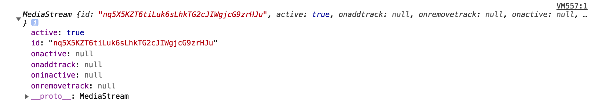
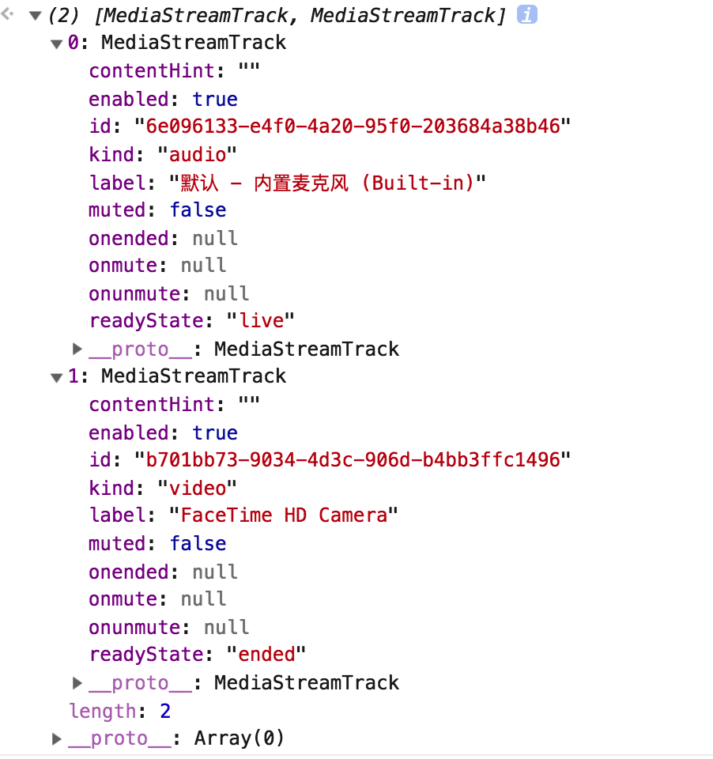
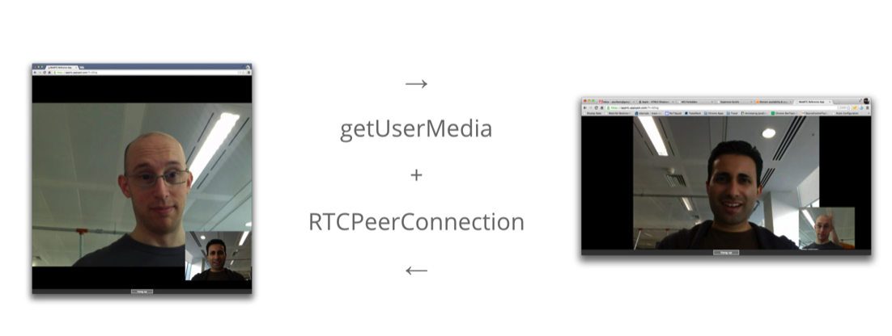

# 2.3 WebRTC在浏览器的核心API
WebRTC在浏览器中，有3个核心对象，MediaStream, PeerConnection, DataChannel。其中MediaStream是一个媒体流对象，用于标识获取到的媒体流信息；PeerConnection是WebRTC P2P传输的连接对象；DataChannel是数据通道对象。    

## 2.3.1 MediaStream   

MediaStream封装了一套API，可以拥有对从摄像头，麦克风获取到的媒体流的操作权限。我们可以通过MediaDevices.getUserMedia()来获取到摄像头，麦克风的媒体流对象。
````
// 通过constraints指明需要获取的媒体源数据，constraints还有很多其他配置参数哦～后面会详细讲解
const constraints = {
  audio: true,
  video: true
};
try {
    const stream = await navigator.mediaDevices.getUserMedia(constraints);
    console.log(stream);
  } catch (e) {
    handleError(e);
  }
````   
输出结果：
         

变量stream则是获取到是一个MediaStream对象，一个MediaStream对象可以有0到多个MediaStreamTrack组成，一个MediaStreamTrack代表一路音频轨道或者视频轨道。    
**补充mediaStream结构图**       

每个MediaStream对象都有一个唯一的id来表示，可以通过MediaStream对象id属性来取到值。MediaStream也提供了ended属性来表示该媒体流对象是否已经结束。   

MediaStream事件处理：   
* MediaStream.onaddtrack：当对端的媒体轨道信息被设置完成，触发的事件。
* MediaStream.onended： 媒体轨道媒体流结束
* MediaStream.onremovetrack ：当对端的媒体轨道信息被移除，触发的事件。 

MediaStream核心方法：   
* MediaStream.addTrack() : 将track添加到MediaStream中。  
* MediaStream.clone(): 克隆
* MediaStream.getTracks() : 获取该MediaStream下的所有媒体轨道。
* MediaStream.getAudioTracks() : 获取该MediaStream下的所有音频媒体轨道。
* MediaStream.getTrackById() : 获取该MediaStream下的某一Id的媒体轨道。
* MediaStream.getVideoTracks() : 获取该MediaStream下的所有视频媒体轨道。
* MediaStream.removeTrack() : 删除该MediaStream下的媒体轨道。

我们可以通过MediaStream.getTracks()获取到每个MediaStream下的track数组。   
   
一个MediaStreamTrack有2种生命周期状态：live以及ended。live代表当前轨道的媒体源被激活，但是需要注意的是，如果是静音或者黑屏，其状态依然是live。当媒体源关闭时，状态则是ended。

MediaStreamTrack属性：  
* MediaStreamTrack.enabled   
* MediaStreamTrack.id   
* MediaStreamTrack.kind   
* MediaStreamTrack.label   
* MediaStreamTrack.muted   
* MediaStreamTrack.readonly    
* MediaStreamTrack.readyState    
* MediaStreamTrack.remote    

MediaStreamTrack事件处理：
* MediaStreamTrack.onstarted   
* MediaStreamTrack.onmute   
* MediaStreamTrack.onunmute   
* MediaStreamTrack.onoverconstrained
* MediaStreamTrack.oneended

MediaStreamTrack核心方法： 

* MediaStream.getConstraints() 
* MediaStream.applyConstraints()
* MediaStream.getSettings()  
* MediaStream.getCapabilities()  
* MediaStream.clone()  
* MediaStream.stop()  

在调用getUserMedia可以通过参数传入constraints来设置你到MediaStream参数。比如视频的分辨率，帧率等。    
````
 const stream = await navigator.mediaDevices.getUserMedia({
  audio: true,
  video:  {
    frameRate: {min: 20},
    width: {min: 640, ideal: 1280},
    height: {min: 480, ideal: 720},
    aspectRatio: 3/2
  }
});
````   
* width: 设置分辨率宽度，可通过min, max设置最小最大值   
* height: 设置分辨率高度，可通过min, max设置最小最大值  
* frameRate: 设置帧率   
* aspectRatio: 宽高比  
* facingMode: 镜头朝向，有4种值，分别为：1，user，指正对着用户，类似手机的前置摄像头; 2，environment, 类似手机的后置摄像头；3，left, 位于左侧；4，right,位于右侧。    

简而言之，MediaStream就是一个音视频媒体数据的描述对象，我们可以通过MediaDevices.getUserMedia()来获取到本机音视频设备采集到的媒体数据，并通过PeerConnection或者DataChannel传输给对端用户。反之，对端用户通过PeerConnection或者DataChannel获取到音视频媒体数据，也可以通过MediaStream对象来表示。    


## 2.3.2 RTCPeerConnection   
RTCPeerConnection用来表示一个WebRTC实时媒体连接的对象，该接口提供了创建，保持，监控，关闭连接的方法的实现。
   
我们可以通过下面代码初始化一个RTCPeerConnection对象。
````
const peerConnection = new RTCPeerConnection();
````  
当通讯双方互相生成一个RTCPeerConnection对象后，通过SDP(RTCSessionDescription)交换，以及ice连接建立，双方的连接通道就建立完成。A将通过getUserMedia获取到的MediaStream track，调用addTrack方法。B通过监听onAddTrack方法，就可以监听到对端媒体被添加的回调，接着将onAddTrack方法参数返回的track对象赋值给video/audio的srcObject，就可以播放对端的媒体流了。具体代码如下：      

index.html
````
<!DOCTYPE html>
<html>
<head>
    <meta charset="utf-8">
    <meta name="description" content="WebRTC code samples">
    <meta name="viewport" content="width=device-width, user-scalable=yes, initial-scale=1, maximum-scale=1">
    <title>Peer connection</title>
</head>

<body>

<div id="container">
    <video id="localVideo" playsinline autoplay muted></video>
    <video id="remoteVideo" playsinline autoplay></video>

    <div class="box">
        <button id="startButton">Start</button>
        <button id="callButton">Call</button>
        <button id="hangupButton">Hang Up</button>
    </div>

    <div class="box">
        <span>SDP Semantics:</span>
        <select id="sdpSemantics">
            <option selected value="">Default</option>
            <option value="unified-plan">Unified Plan</option>
            <option value="plan-b">Plan B</option>
        </select>
    </div>

<script src="https://webrtc.github.io/adapter/adapter-latest.js"></script>
<script src="js/main.js" async></script>
</body>
</html>

````
js/mian.js    
````
const startButton = document.getElementById('startButton');
const callButton = document.getElementById('callButton');
const hangupButton = document.getElementById('hangupButton');
callButton.disabled = true;
hangupButton.disabled = true;
startButton.addEventListener('click', start);
callButton.addEventListener('click', call);
hangupButton.addEventListener('click', hangup);

let startTime;
const localVideo = document.getElementById('localVideo');
const remoteVideo = document.getElementById('remoteVideo');

localVideo.addEventListener('loadedmetadata', function() {
  console.log(`Local video videoWidth: ${this.videoWidth}px,  videoHeight: ${this.videoHeight}px`);
});

remoteVideo.addEventListener('loadedmetadata', function() {
  console.log(`Remote video videoWidth: ${this.videoWidth}px,  videoHeight: ${this.videoHeight}px`);
});

remoteVideo.addEventListener('resize', () => {
  console.log(`Remote video size changed to ${remoteVideo.videoWidth}x${remoteVideo.videoHeight}`);
  // We'll use the first onsize callback as an indication that video has started
  // playing out.
  if (startTime) {
    const elapsedTime = window.performance.now() - startTime;
    console.log('Setup time: ' + elapsedTime.toFixed(3) + 'ms');
    startTime = null;
  }
});

let localStream;
let pc1;
let pc2;
const offerOptions = {
  offerToReceiveAudio: 1,
  offerToReceiveVideo: 1
};

function getName(pc) {
  return (pc === pc1) ? 'pc1' : 'pc2';
}

function getOtherPc(pc) {
  return (pc === pc1) ? pc2 : pc1;
}

async function start() {
  console.log('Requesting local stream');
  startButton.disabled = true;
  try {
    const stream = await navigator.mediaDevices.getUserMedia({audio: true, video: true});
    console.log('Received local stream');
    localVideo.srcObject = stream;
    localStream = stream;
    callButton.disabled = false;
  } catch (e) {
    alert(`getUserMedia() error: ${e.name}`);
  }
}

function getSelectedSdpSemantics() {
  const sdpSemanticsSelect = document.querySelector('#sdpSemantics');
  const option = sdpSemanticsSelect.options[sdpSemanticsSelect.selectedIndex];
  return option.value === '' ? {} : {sdpSemantics: option.value};
}

async function call() {
  callButton.disabled = true;
  hangupButton.disabled = false;
  console.log('Starting call');
  startTime = window.performance.now();
  const videoTracks = localStream.getVideoTracks();
  const audioTracks = localStream.getAudioTracks();
  if (videoTracks.length > 0) {
    console.log(`Using video device: ${videoTracks[0].label}`);
  }
  if (audioTracks.length > 0) {
    console.log(`Using audio device: ${audioTracks[0].label}`);
  }
  const configuration = getSelectedSdpSemantics();
  console.log('RTCPeerConnection configuration:', configuration);
  pc1 = new RTCPeerConnection(configuration);
  console.log('Created local peer connection object pc1');
  pc1.addEventListener('icecandidate', e => onIceCandidate(pc1, e));
  pc2 = new RTCPeerConnection(configuration);
  console.log('Created remote peer connection object pc2');
  pc2.addEventListener('icecandidate', e => onIceCandidate(pc2, e));
  pc1.addEventListener('iceconnectionstatechange', e => onIceStateChange(pc1, e));
  pc2.addEventListener('iceconnectionstatechange', e => onIceStateChange(pc2, e));
  pc2.addEventListener('track', gotRemoteStream);

  localStream.getTracks().forEach(track => pc1.addTrack(track, localStream));
  console.log('Added local stream to pc1');

  try {
    console.log('pc1 createOffer start');
    const offer = await pc1.createOffer(offerOptions);
    await onCreateOfferSuccess(offer);
  } catch (e) {
    onCreateSessionDescriptionError(e);
  }
}

function onCreateSessionDescriptionError(error) {
  console.log(`Failed to create session description: ${error.toString()}`);
}async function onCreateOfferSuccess(desc) {
  console.log(`Offer from pc1\n${desc.sdp}`);
  console.log('pc1 setLocalDescription start');
  try {
    await pc1.setLocalDescription(desc);
    onSetLocalSuccess(pc1);
  } catch (e) {
    onSetSessionDescriptionError();
  }

  console.log('pc2 setRemoteDescription start');
  try {
    await pc2.setRemoteDescription(desc);
    onSetRemoteSuccess(pc2);
  } catch (e) {
    onSetSessionDescriptionError();
  }

  console.log('pc2 createAnswer start');
  // Since the 'remote' side has no media stream we need
  // to pass in the right constraints in order for it to
  // accept the incoming offer of audio and video.
  try {
    const answer = await pc2.createAnswer();
    await onCreateAnswerSuccess(answer);
  } catch (e) {
    onCreateSessionDescriptionError(e);
  }
}

function onSetLocalSuccess(pc) {
  console.log(`${getName(pc)} setLocalDescription complete`);
}

function onSetRemoteSuccess(pc) {
  console.log(`${getName(pc)} setRemoteDescription complete`);
}

function onSetSessionDescriptionError(error) {
  console.log(`Failed to set session description: ${error.toString()}`);
}

function gotRemoteStream(e) {
  if (remoteVideo.srcObject !== e.streams[0]) {
    remoteVideo.srcObject = e.streams[0];
    console.log('pc2 received remote stream');
  }
}

async function onCreateAnswerSuccess(desc) {
  console.log(`Answer from pc2:\n${desc.sdp}`);
  console.log('pc2 setLocalDescription start');
  try {
    await pc2.setLocalDescription(desc);
    onSetLocalSuccess(pc2);
  } catch (e) {
    onSetSessionDescriptionError(e);
  }
  console.log('pc1 setRemoteDescription start');
  try {
    await pc1.setRemoteDescription(desc);
    onSetRemoteSuccess(pc1);
  } catch (e) {
    onSetSessionDescriptionError(e);
  }
}

async function onIceCandidate(pc, event) {
  try {
    await (getOtherPc(pc).addIceCandidate(event.candidate));
    onAddIceCandidateSuccess(pc);
  } catch (e) {
    onAddIceCandidateError(pc, e);
  }
  console.log(`${getName(pc)} ICE candidate:\n${event.candidate ? event.candidate.candidate : '(null)'}`);
}

function onAddIceCandidateSuccess(pc) {
  console.log(`${getName(pc)} addIceCandidate success`);
}

function onAddIceCandidateError(pc, error) {
  console.log(`${getName(pc)} failed to add ICE Candidate: ${error.toString()}`);
}

function onIceStateChange(pc, event) {
  if (pc) {
    console.log(`${getName(pc)} ICE state: ${pc.iceConnectionState}`);
    console.log('ICE state change event: ', event);
  }
}

function hangup() {
  console.log('Ending call');
  pc1.close();
  pc2.close();
  pc1 = null;
  pc2 = null;
  hangupButton.disabled = true;
  callButton.disabled = false;
}
````
关于SDP交换以及ICE通道建立，将在后续章节详细介绍。    
  
## 2.3.3 RTCDataChannel    
除了音视频媒体流之外，WebRTC还提供了其他类型的实时通讯能力，RTCDataChannel。RTCDataChannel是一个用于建立对端之间双向数据通道的对象。我们可以把它当成一个类似websocket的双向数据传输通道，不同之处在于RTCDataChannel默认采用基于UDP的SCTP传输协议来, 具备UDP低延迟，高吞吐量，也拥有类TCP的可靠传输等特点。RTCDataChannel有很多潜f在的应用特征，比如游戏，远程桌面，实时通讯，文件传输，分布式网络。  
我们可以通过RTCPeerConnection定createDataChannel方法来创建一个RTCDataChannel通道。并且通过send方法，来发送数据给对端，通过onmessage监听对端传递过来的数据。

````
const localConnection = new RTCPeerConnection(servers);
const remoteConnection = new RTCPeerConnection(servers);
const sendChannel =
  localConnection.createDataChannel('sendDataChannel');

remoteConnection.ondatachannel = (event) => {
  receiveChannel = event.channel;
  receiveChannel.onmessage = onReceiveMessage;
  receiveChannel.onopen = onReceiveChannelStateChange;
  receiveChannel.onclose = onReceiveChannelStateChange;
};

function onReceiveMessage(event) {
  document.querySelector("textarea#send").value = event.data;
}

document.querySelector("button#send").onclick = () => {
  var data = document.querySelector("textarea#send").value;
  sendChannel.send(data);
};
````